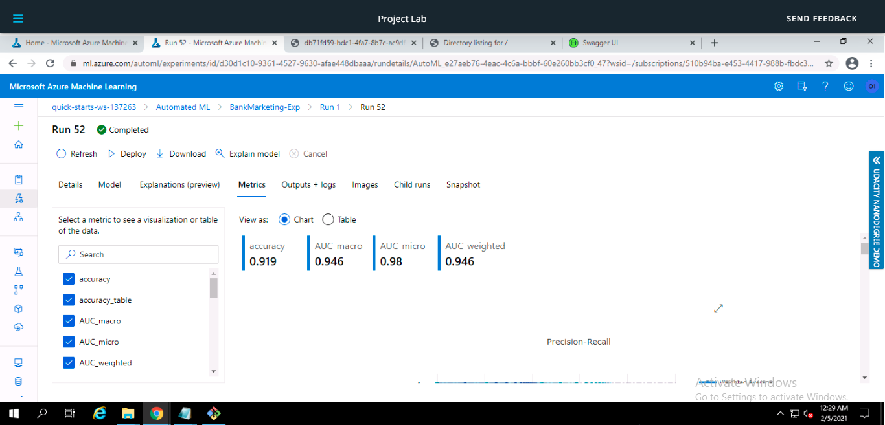

# Operationalizing Machine Learning 

In this project, I worked on the Bank Marketing dataset using Azure ML studio, where I  configured a cloud-based machine learning production model, deploy it as a REST endpoint, and consumed it using HTTP, then created, published and consumed the pipeline.

## Architectural Diagram

## Key Steps

1- Create a new Automated ML run, then select and upload the **Bank Marketing dataset** from [here](https://automlsamplenotebookdata.blob.core.windows.net/automl-sample-notebook-data/bankmarketing_train.csv) or create it from web files using this link [https://automlsamplenotebookdata.blob.core.windows.net/automl-sample-notebook-data/bankmarketing_train.csv](https://automlsamplenotebookdata.blob.core.windows.net/automl-sample-notebook-data/bankmarketing_train.csv), I used the second method.

2- Configured a compute cluster(VM Size: Standard_DS2_V2, number of minimum nodes = 1, number of maximum nodes = 4, Exit criterion = 1, Concurrency = 5) then ran the experiment using *classification*.
The experiment took almost 30 minutes, then the status changed to **Completed**.

In Experiment section

In AutoML section

3- The AutoML run had different models as shown below, the models were ranked based on the **Accuracy** metric, and the best model is **VotingEnsemble** with accuracy of **0.91866**

4- Deploy the best model and enable the **Authentication**, you will see the deployment status as **succeeded** 

Then I waited and had the deployment state as **Healthy** and got the **Swagger URI** and **REST endpoint**,

You can also notice that the **Application Insights** is false at this moment because I didn't enable them yet.

5- Here I want to enable the logging (enabling Application Insights), and this was done using `logs.py` script, and setting the value to `true` using this line of code `service.update(enable_app_insights = True)`.

Now we will have the application insights enabled as you can see, and also the **Application Insights URI** was generated.

6- In this step **Swagger** is used, I used `swagger.sh` to run a swagger docker image as it contains this command `docker run -p 80:8080 swaggerapi/swagger-ui` Swagger is now running on port 80.

7- `serve.py` script is used to start a python server on port 8000 as it serves the `swagger.json` on an HTTP server. 

8- `endpoint.py` is used to consume/ interact with the deployed model, we update `endpoint.py` by modifying the `scoring_uri` with the **REST endpoint** and `key` with the **Primary key** that were generated after deployment.
Then the result will be returned as a JSON file.

9- Apache Benchmarking is used to benchmark the deployed model.

Then data will be saved as JSON file

10- Now this part of the project was done using Azure Python SDK to create, consume and publish a pipeline using the Jupyter notebook [aml-pipelines-with-automated-machine-learning-step](https://github.com/fati-ma/nd00333_AZMLND_C2/blob/master/aml-pipelines-with-automated-machine-learning-step%20(2).ipynb), and updated the key, URI's, cluster name, and experiemnt name.
**First** created a pipeline 

You can see the pipeline runs 

11- Here when the pipeline endpoint was created.

12- In the image below you can see the pipeline graph that shows the Bank Marketing dataset

13- After the pipeline is **published** we can see the **Published Pipeline Overview** where the status is *Active* and we have the *REST endpoints*

14- This is the run details of pipeline endpoint run in the notebook using `RunDetails` widget

## Screen Recording

This is the [screen record](https://drive.google.com/file/d/1HtMxSrD0viGXShNBoAexjr8OOINj7iR7/view?usp=sharing) of the project

## Standout Suggestions

I would try to increase the AutoML run time to test many more models and compare the results or usind different metrics to choose the best model, also the accuracy of the model can be improved by removing the class imbalance in the dataset.

